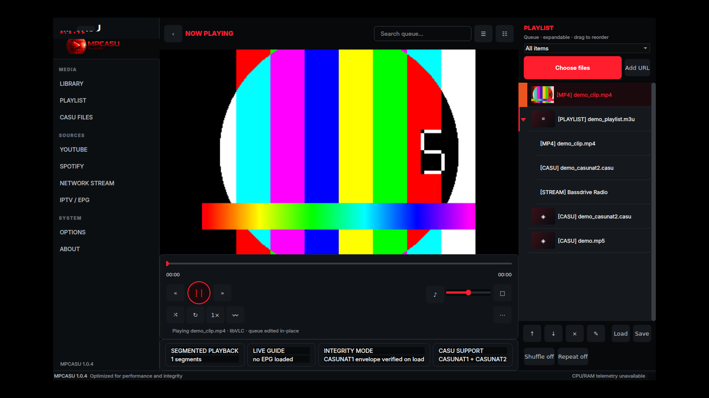
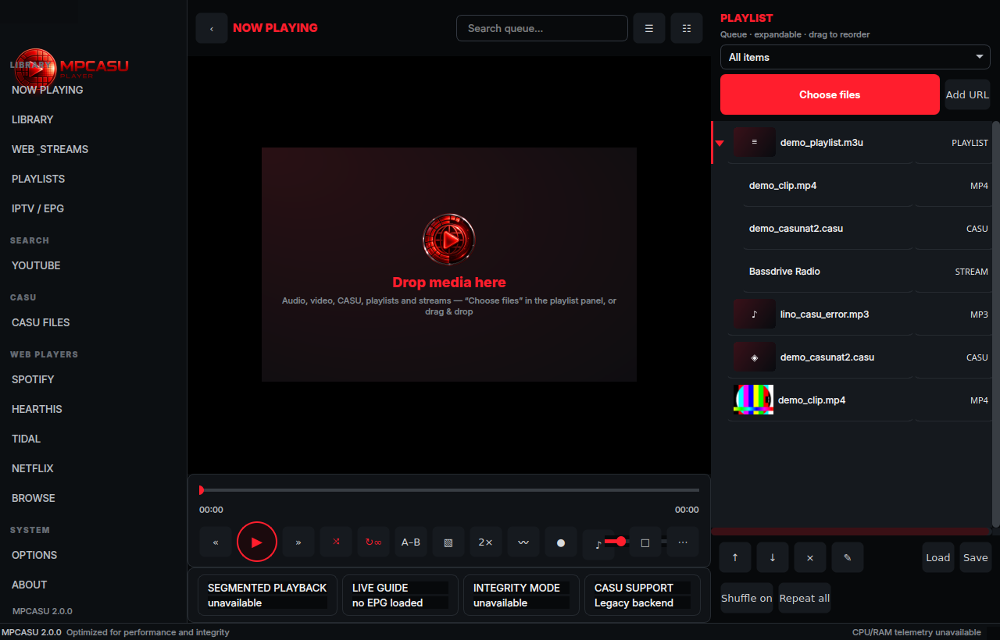
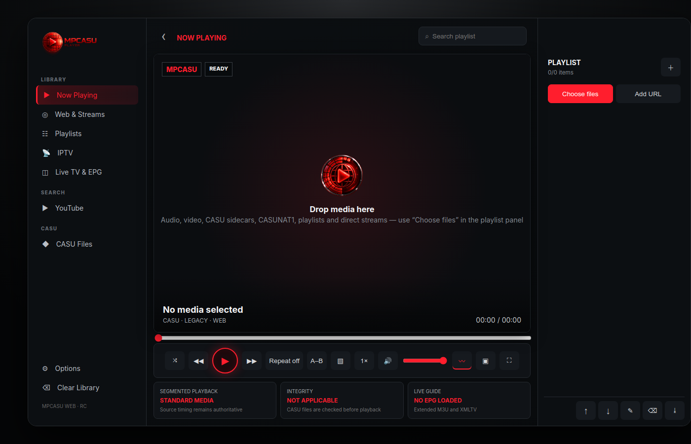
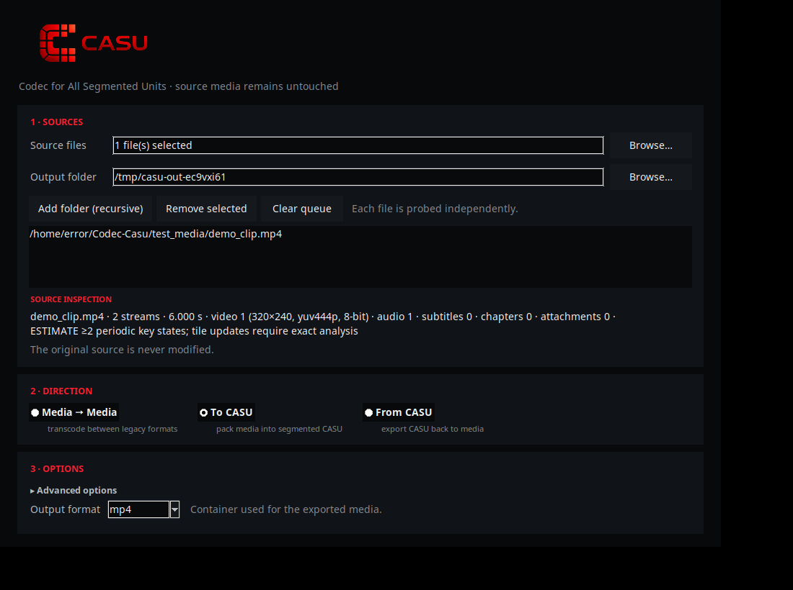
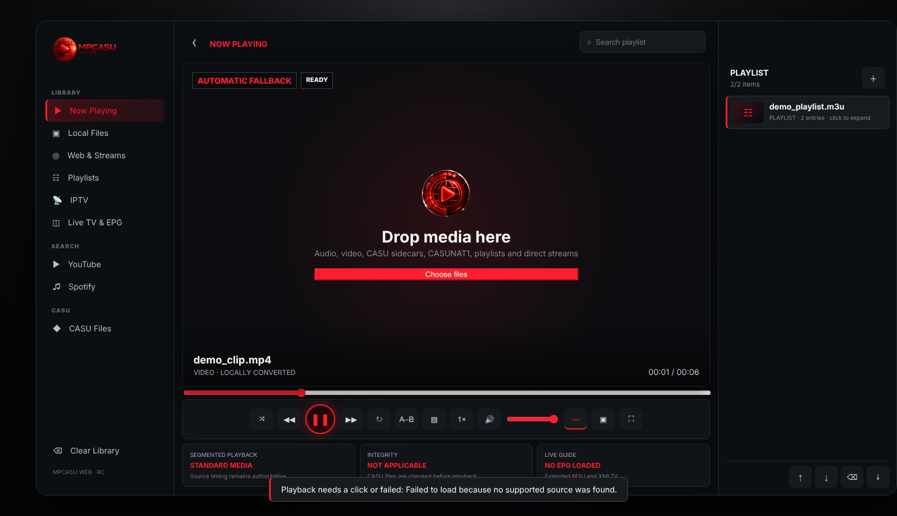
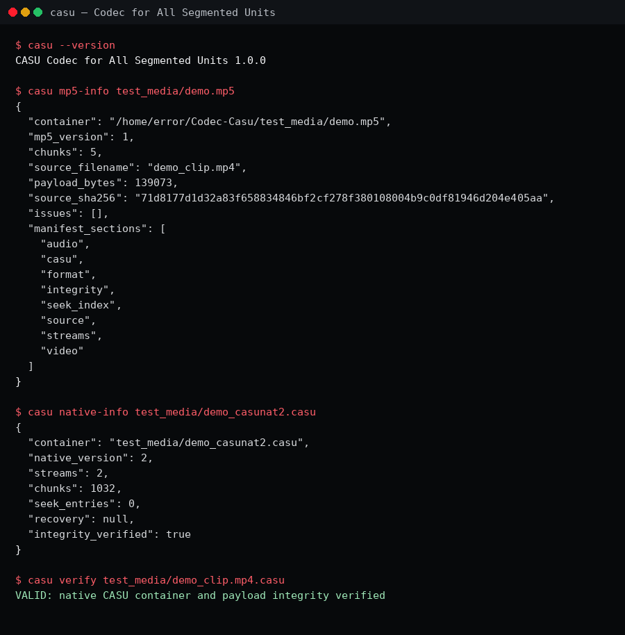

# CASU & MPCASU — Segmented-State Media Codec, Player, Converter

CASU (**C**odec for **A**ll **S**egmented **U**nits) is a standalone segmented
media container family (CASUNAT1, CASUNAT2, MP5). MPCASU is the accompanying
media player suite: a Qt desktop player, a local web player, a batch converter
and a CLI. Everything installs system-wide via Debian packages and does not
interfere with VLC, GStreamer or FFmpeg.

> **Version:** `2.0.0` — see [RELEASE_GATE_STATUS.json](RELEASE_GATE_STATUS.json).
> Gates 1–3 (source-resolution STRICT, CASUNAT2 native payload, integrity /
> recovery / fuzzing) are **PASS**. Gates 4–6 (native player path, media
> management / converter, product UI / release regression) are honestly
> documented as **PARTIAL**: their full regression matrices were gathered on
> the Tk reference player; the Qt player that ships as `mpcasu` since 1.0.0
> passes its own backend and smoke suites but has not re-run every matrix.

---

## The four programs

| Package | Program | Role | Launch |
|---|---|---|---|
| `casu-codec` | CASU CLI | Analyze, pack (CASUNAT1/2, MP5), verify, repair, export, transcode | `casu` |
| `casu-converter` | CASU Converter | Single-file, multi-file and recursive-folder conversion GUI | `casu-converter` |
| `mpcasu` | MPCASU Desktop | Qt player: CASU native + everything installed libVLC plays | `mpcasu` |
| `web-casu` | MPCASU Web | Local web player: files, streams, playlists, EPG, CASU in the browser | `web-casu` |



CASUNAT2 stores reconstructable video key states, tile changes, time-stamped
PCM, text/bitmap subtitles, chapters, metadata and attachments. The original
source file is **not** required for native playback.

---

## Installation (Debian packages)

```bash
./packaging/build_debs.sh          # builds into dist/ (or use shipped DEBs)
cd dist
sha256sum -c SHA256SUMS
sudo dpkg -i casu-codec_2.0.0_all.deb \
             casu-converter_2.0.0_all.deb \
             mpcasu_2.0.0_all.deb \
             web-casu_2.0.0_all.deb
sudo apt-get -f install            # only if dependencies are missing
```

The packages install `/usr/bin/casu`, `/usr/bin/casu-converter`,
`/usr/bin/mpcasu`, `/usr/bin/web-casu`, desktop entries, icons and the
documentation/web assets under `/usr/share/casu-codec/`.

Requirements: Python 3.10+ (3.14 tested), libVLC, FFmpeg/ffprobe, PyAV,
PySide6 (desktop player), yt-dlp (optional, YouTube),
  spotDL (optional, legitimate Spotify provider: Spotify Web API metadata +
  YouTube matching, `pip install spotdl` or /opt/casu-spotdl venv).

---

## Desktop player (Qt)

```bash
mpcasu                        # launch
mpcasu /path/to/video.mp4     # play a file
mpcasu /path/to/file.casu     # play a CASU container
```

The sidebar is organized into **MEDIA** (now playing, library, web & streams,
playlists, IPTV / EPG), **SEARCH** (YouTube), **CASU** (CASU files),
**WEB PLAYERS** (Spotify, Hearthis, Tidal, Netflix, Browse — embedded
QtWebEngine tabs with persistent cookies) and **SYSTEM** (options, about).
YouTube and network streams resolve in a worker thread and play in-app. The
library page browses indexed folders by artist / album / genre with a live
search; watched folders are added/removed and scanned (recursive subfolders,
audio tags + file-name metadata) right on the page or in Options. All feedback
uses web-style toasts; there are no modal popups during playback.

## Screenshots





Further screenshots: `docs/screenshots/mpcasu.png` (desktop),
`docs/screenshots/web-casu.png` (web), `docs/screenshots/casu-converter.png`
(converter), `docs/screenshots/casu-codec-cli.png` (CLI).

**Shortcuts:**

| Key | Action |
|---|---|
| `Space` | Play / Pause |
| `F` | Fullscreen |
| `M` | Mute |
| `S` | Stop |
| `←` / `→` | Seek −10 / +10 s |
| `↑` / `↓` | Volume + / − |
| `Ctrl+O` | Open file |
| `Ctrl+L` | Open network URL |
| `Ctrl+I` | Media information |
| `Esc` | Leave fullscreen / close dialog |

The playback route is selected automatically by content inspection:

- **CASUNAT2** → `NativeCasuBackend` (key-state/tile/PCM, Qt video sink,
  PulseAudio)
- **CASUNAT1** compatibility containers and **MP5** enhanced containers →
  verified extraction path via libVLC
- **Legacy JSON CASU manifests** (require the original source file) →
  explicitly labelled legacy compatibility path; re-pack to CASUNAT2 for
  standalone playback
- All other audio/video/streams → libVLC in-process

Features: playlists (M3U/M3U8/PLS/JSON) as expandable groups with format
badges, drag-and-drop reorder, context menu and load/save; shuffle and repeat
(off/all/one); session restore; EPG (Extended-M3U/XMLTV) with now/next;
YouTube resolution behind the yt-dlp consent gate (personal use only,
URLs never stored or redistributed); track/chapter/subtitle selection;
snapshot; A–B loop; bookmarks; equalizer; mini mode.

> The original Tk player (`mpcasu_player.py`) remains in the repository as a
> reference implementation and test base; `mpcasu` ships the Qt player.

---

## Converter

```bash
casu-converter
```

Three-step UI (SOURCES → DIRECTION → OPTIONS) in the shared red/black design
system. Directions:

| Direction | Description |
|---|---|
| media → media | Any FFmpeg-decodable input to any common output |
| media → CASU | Encode into CASU (CASUNAT1 sidecar or standalone CASUNAT2) |
| CASU → media | Reconstruct CASU back to standard media |

All directions support single files, multi-selection and recursive folders.
Profiles: `remux`, `balanced`, `high`, `small`, `lossless`. Batch reports
carry source/output hashes, profile hash, frame/key/tile/audio/subtitle
counters, runtime and verification state (CSV/Markdown export).



---

## Web player

```bash
web-casu                    # binds 127.0.0.1, opens the browser
web-casu --port 8080        # custom port
web-casu --no-browser       # headless
web-casu --check            # verify assets and exit
```

Views (Now Playing / Web & Streams / Playlists / IPTV / YouTube / CASU) filter
the queue; playlists load as expandable groups and the queue can be saved as
an M3U download. Features: drag-and-drop, adaptive FFmpeg fallback for
browser-unsupported formats, YouTube iframe, M3U/PLS/XMLTV with searchable
EPG, SRT/WebVTT subtitles, sidecar/CASUNAT1 SHA-256 verification, native
CASUNAT2 key/tile/PCM decoding with track/subtitle/chapter selection,
same-origin stream proxy so live streams feed the FFT visualizer, fullscreen,
snapshot, Picture-in-Picture. Security: foreign Host/Origin rejected, CSP and
restrictive headers.



---

## CLI

```bash
# Standalone native CASUNAT2
casu pack-v2 input.mkv --output output.casu

# CASU MP5 enhanced container (playable, integrity-checked)
casu pack-mp5 input.mp4 --output output.mp5
casu mp5-info output.mp5            # compact summary (--full for manifest)

# General conversion / inspection
casu convert input.mp4 --container native-v2 --output output.casu
casu verify output.casu
casu native-info output.casu
casu info output.casu

# Back to standard media
casu export output.casu --output restored.mp4

# Direct transcode / remux
casu transcode input.avi --output output.mp4 --preset high
casu transcode input.mkv --output copy.mkv --preset remux

# Recover the last verified prefix of a damaged container
casu repair-v2 damaged.casu --output recovered.casu
```



---

## Test suite

```bash
python3 -m pytest -q -m 'not media'                      # 233 passed
xvfb-run -a python3 -m pytest tests/test_converter_ui.py tests/test_player_ui.py -q
python3 -m pytest -q tests/test_native_player_backend.py # 23 passed
node --check web/app.js && node --check web/casu-native.js
xvfb-run -a python3 tools/smoke_backends.py              # MP4/CASUNAT2/MP5 > 1 s
```

Verified playback paths: MP4 → LibVLCBackend, CASUNAT2 → NativeCasuBackend
(Tk and Qt sinks), MP5 → LegacyCasuBackend — each measured > 1 s of playback.

---

## Architecture

```text
Normal media ── libVLC ────────────────────┐
HTTP/HLS/RTSP/YouTube ─ libVLC/yt-dlp ─────┼─ MPCASU (Qt) / MPCASU Web
CASUNAT2 ─ NativeCasuBackend ──────────────┘
CASUNAT1 / MP5 ─ LegacyCasuBackend (verify → extract → libVLC)

Media ─ FFmpeg/PyAV ─ CASUNAT1/CASUNAT2/MP5 ─ CASU reader/player/exporter
```

| Module | Purpose |
|---|---|
| `casu/strict/` | Source-resolution, plane-aware, PTS-exact analysis |
| `casu/native_v2/` | CASUNAT2 container, reader/writer, seek, integrity, recovery |
| `casu/mp5/` | MP5 enhanced container (writer/reader/verify) |
| `casu/jobs.py` | Atomic batch engine with resume, cancel, reports |
| `mpcasu_backend.py` | libVLC compatibility backend (ctypes, no python-vlc) |
| `mpcasu_native_backend.py` | Standalone native CASU playback |
| `mpcasu_qt/` | Qt desktop player (official `mpcasu` since 1.0.0) |
| `web/` | Browser-based MPCASU player |

---

## Real-world limitations

- Legacy format support is whatever the installed VLC build and its modules
  expose — no artificial whitelist, no untested universal claims.
- Bitmap subtitles play natively and burn into video on export; PGS/DVD/DVB/
  XSub cannot remux into every target container.
- YouTube resolution requires yt-dlp and explicit user consent.
- Spotify uses spotDL as provider (Spotify Web API metadata + YouTube
  match, `spotdl url`, no downloads written). Without spotDL or on blocked
  networks the players say so honestly and offer the explicit, clearly
  labelled “Find on YouTube” handoff; YouTube results are never labelled as
  Spotify streams.
  (personal use only).
- Physical audio hardware, Windows/macOS packages and long-duration power
  measurement require separate platform tests.

---

## Acknowledgments

MPCASU is an **independent, original implementation**. Its design, feature set
and workflow were studied from and inspired by the open-source
[VLC media player](https://www.videolan.org/vlc/) and by
[Webamp](https://webamp.org/) (the Winamp-style web player) — but no code
from VLC, Webamp, Winamp or any other third-party project is copied or
derived in this repository. Runtime dependencies (libVLC, FFmpeg, PyAV,
PySide6, yt-dlp) remain separately licensed, unmodified external components;
see [THIRD_PARTY_COMPONENTS.md](THIRD_PARTY_COMPONENTS.md). VLC and
Winamp/Webamp are trademarks of their respective owners; no affiliation or
endorsement is implied.

---

## Further reading

- [CASU Format Specification](CASU_FORMAT_SPECIFICATION.md)
- [Release Gate Status](RELEASE_GATE_STATUS.json)
- [Release Policy](RELEASE_POLICY.md)
- [Converter Documentation](docs/CASU_CONVERTER.md)
- [MPCASU Feature Matrix](MPCASU_FEATURE_COMPLETION_MATRIX.md)
- [60-Step Roadmap](ROADMAP_60_STEPS.md)
- [Licenses & Third-Party Components](THIRD_PARTY_COMPONENTS.md)

**License:** Anti-Capitalist License 1.4 / All Rights Reserved, Lino Casu.
Third-party components retain their respective licenses.
